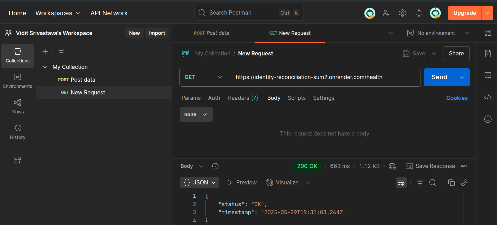
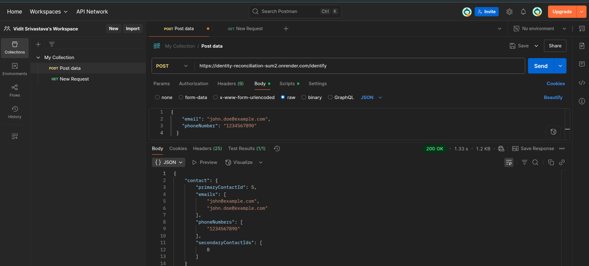

# Identity Reconciliation

- **Live Endpoint** - https://identity-reconciliation-sum2.onrender.com/identify
- **Health Check** - https://identity-reconciliation-sum2.onrender.com/health

## Tech Stack

### Backend
| Component | Technology | Version |
|-----------|------------|---------|
| **Runtime** | Node.js | ≥18.0.0 | 
| **Language** | TypeScript | 5.1.6 | 
| **Framework** | Express.js | 4.18.2 | 
| **Database** | PostgreSQL | 15| 
| **ORM** | Prisma | 6.8.2 | 
| **Security** | Helmet.js | 7.0.0 |
| **Logging** | Morgan | 1.10.0 | 

### Services
| Component | Service |
|-----------|---------|
| **Hosting** | Render Web Services| 
| **Database** | Render PostgreSQL | 
| **Version Control** | GitHub | 

## Directory Tree
```
identity-reconciliation/
├── src/
│   ├── index.ts                    
│   ├── routes/
│   │   └── identity.ts             
│   ├── services/
│   │   └── identityService.ts      
│   ├── middleware/
│   │   ├── validation.ts           
│   │   └── errorHandler.ts         
│   └── types/
│       └── index.ts                
├── prisma/
│   └── schema.prisma               
├── .env.example                    
├── .gitignore                      
├── package.json                    
├── tsconfig.json                   
├── Dockerfile                     
└── README.md                       
```
## API Documentation

### **Headers**
All `POST` requests require 
```bash
Content-Type: application/json
```
### Health Check Endpoint
`GET /health`

Verifies service status and connectivity.



**Status Codes:**

- **200** - Service is healthy
- **500** - Service error

### Identity Reconciliation Endpoint
`POST /identify`

Main endpoint that processes contact information and returns consolidated customer data.



**Validation Rules:**

- At least one of `email` or `phoneNumber` must be provided
- `email` must be valid email format (if provided)
- `phoneNumber` must be non-empty string (if provided)
- Both fields can be provided together

**Success Response (200):**
```JSON
{
  "contact": {
    "primaryContactId": 1,
    "emails": ["user@example.com"],
    "phoneNumbers": ["1234567890"],
    "secondaryContactIds": []
  }
}
```

**Error Response (400):**
```JSON
{
  "error": "Bad Request",
  "message": "At least one of email or phoneNumber must be provided"
}
```
**Response Fields**

| Field | Type | Description |
|-----------|------------|---------|
| `primaryContactId` | number | 	ID of the primary contact | 
| `emails` | string[]|All emails associated with this customer (primary first)| 
| `phoneNumbers`| string[] | All phone numbers associated (primary first) | 
| `secondaryContactIds` | number[] | IDs of all secondary contacts linked to primary| 


